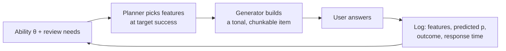

<!-- Exported from the Claude doc "Hearing Trainer — Vision & Plan" (https://claude.ai/code/artifact/c5840658-5c50-419e-b39c-19a6dc262f66), 24 Sep 2026. The doc is the editable original; regenerate this file from it after edits. -->

# Hearing Trainer — Vision & Plan

Sep 24, 2026 · @Nik

## Where the project stands (24 Sep 2026)

The app is two days old and already has a working core loop: tap Play, hear a 3-note C-major melody, play it back on a one-octave keyboard, see per-note feedback. One commit is on GitHub (`Avogard/hearing-trainer`, 23 Sep: "Add core melody generator, audio playback, and working practice-loop MVP"); everything since is uncommitted or sitting in `Claude outputs/` waiting to be folded in.

| Area | State | Where it lives |
| --- | --- | --- |
| `core/` theory, generator, scoring, Level 1 | Built, unit-tested, committed | `app/src/main/java/.../core/` |
| `audio/` SoundPool player, synthesized piano samples | Built, committed | `audio/`, `res/raw/piano_c{3,4,5}.wav` |
| `ui/` Home (placeholder), Practice, PianoKeyboard | Built, committed | `ui/home`, `ui/practice`, `ui/keyboard` |
| Level 1 fix (`maxInterval` 2→4) + regression test, build fixes | In working tree, not committed | `core/DifficultyLevel.kt`, `docs/` |
| `data/` Room progress store, streak, 10-melody session, Session Summary screen, Home with streak, `core/Clock` | Written, not yet integrated or built | `Claude outputs/` (14 files + `DECISIONS-final.md`) |
| Settings screen + DataStore, reminders (WorkManager), levels 2–5, promotion rule, Custom mode | Not started | — |

The docs are in good shape for a two-day-old project: `docs/SPEC.md` defines the v1 loop, screens and a five-level ladder; `docs/DECISIONS.md` has 13 dated entries (native Kotlin/Compose over Flutter, pure-Kotlin `core/` for a future iOS port, SoundPool first, no backend in v1, good defaults over settings); `docs/IDEAS.md` parks guitar/fretboard input, MIDI keyboards, sing-back, harmony and rhythm modes, badges, leagues, adaptive reminders and a Pro tier.

Two process gaps worth fixing before the plan below adds more code. First, the `Claude outputs/` batch exists because the source tree sits eight folders deep, past what the folder bridge can reach; connecting `app/src/main/java/com/hearingtrainer/app` as a second folder (or running Claude Code in a terminal on the laptop) lets future sessions edit `core/` and `ui/` in place. Second, the uncommitted work should be committed and pushed now, per CLAUDE.md, before the persistence batch lands on top of it.

What this means for planning: the architecture rules (four boundary interfaces, exercises as data, one config file, feature flags) are exactly the seams the plan needs, so nothing below asks for a rewrite. The two things the current design does not yet have, and which the rest of this document argues are the heart of the product, are a tonal context before each melody and an adaptive engine instead of a fixed ladder.

## Vision

**The promise: hear a song, then play it.** Every other ear trainer drills intervals and chords in a vacuum and leaves the transfer to real music as the user's problem. This app trains hearing *in a key*, on song-shaped material, with an engine that keeps each person at the edge of their ability, and it measures whether the skill carries over to real songs.

**The bet.** Five things together, none of which any Android app does today (see the landscape section): tonal context as the backbone instead of isolated intervals; melodies that sound like music, not random walks; a difficulty engine fitted to each user rather than a fixed ladder; a Duolingo-grade daily habit loop on top of real teaching; and a ladder that ends in real recordings instead of in a drill. The nearest competitors have one or two of these each (Functional Ear Trainer has the method but no habit loop; Duolingo Music has the loop but teaches note reading; Chet uses real recordings but is iOS-only).

**Principles that decide every feature:**

1. **Scale degrees in a key, always.** A note is trained as "the 6th of this key", never as "a major 6th above something". The key context (cadence, then drone, then nothing) fades as the user improves.
2. **Song-shaped from day one, real songs as soon as possible.** Generated melodies use stepwise motion, chord tones, motifs and rhythmic grouping; accompaniment, other timbres and finally real recordings arrive step by step.
3. **Challenging, never hopeless.** The engine aims at about 80% first-try success per person, opens easy, mixes in easy items, and steps down fast when a session goes badly.
4. **One honest number per skill, and "better than yesterday".** Progress is a calibrated estimate of ability that can go down, compared with your own past, and it tells you what to practise next. No points, no hearts, no gems.
5. **The daily loop is tiny, free and one tap away.** 5–8 minutes, no settings on the default path, never paywalled, never capped.
6. **Habit mechanics that respect the user.** A streak with built-in slack and repair, badges for real accomplishments, at most one reminder a day, no guilt copy, no selling streak protection.
7. **Measure transfer.** A weekly check on untrained real melodies is the product's north-star metric. If in-app gains don't show up there, the product is wrong, and we want to know early.
8. **Portable core.** Everything about music and learning is pure Kotlin behind the four boundary interfaces already in CLAUDE.md, so iOS and new instruments are additions, not rewrites.

## Who it is for

**First user: Nik.** Between beginner and intermediate, no single instrument yet, wants a placement test and an adaptive curve early, practising in the evenings. The first milestone is simply "Nik practises every day and can feel the difference in four weeks". Everything in Phase 0 serves that and nothing else.

**Then, in this order:**

| Persona | What they want | Who serves them today | Why they matter |
| --- | --- | --- | --- |
| The hobbyist who plays from tabs or sheet music (guitar, piano, ukulele) and cannot figure out songs by ear | To hear a song and find it on the instrument; chords of pop songs | Nobody end to end: Yousician, Simply Piano and flowkey listen to you play but do not teach the ear ([HackerNoon, Feb 2026](https://hackernoon.com/best-piano-learning-apps-in-2026-an-in-depth-comparison-of-music-education-technology)) | The biggest group: the song-learning apps have 50M+ installs each on Google Play |
| The music student | Dictation and sight-singing practice for class or exams (ABRSM, RCM) | EarMaster, Auralia (schools), Complete Ear Trainer | Pays reliably, but wants exam-shaped drills; served later through content packs |
| The singer, songwriter or producer | Hum an idea and know what it is; hear chord progressions | Sonofield, Functional Ear Trainer, Chord Crush (web only) | Values singing input and harmony; a natural Pro segment |
| The improviser (jazz, blues) | Transcribe solos, hear chord tones and chromaticism | Chet (iOS only) | Small but vocal; drives the top of the ladder |

**Not for:** children (a different product, different rules), and people who want perfect pitch. Adults can rarely be trained to absolute pitch (2 of 6 and 6 of 43 learners in the two best studies: [Van Hedger 2019](https://journals.plos.org/plosone/article?id=10.1371%2Fjournal.pone.0223047), [Wong 2020](https://link.springer.com/article/10.3758/s13414-019-01869-3)), and relative, functional hearing is what playing by ear needs ([review, 2025](https://pmc.ncbi.nlm.nih.gov/articles/PMC11750914/)).

## What music pedagogy says

**The one finding that reshapes the app: train scale degrees in a key, not intervals in isolation.** Karpinski's textbook on aural skills sums up the experimental literature: there is "little connection between the ability to identify intervals acontextually and the ability to do so in a tonal context", and the brain most likely encodes melodies as scale degrees ([Chenette 2021, quoting Karpinski](https://mtosmt.org/issues/mto.21.27.2/mto.21.27.2.chenette.html)). Most US college theory instructors teach with systems that emphasise scale-degree function ([Paney & Buonviri 2017](https://journals.sagepub.com/doi/10.1177/8755123316686815)). The three best-known practitioner methods agree on the drill: play a cadence to set the key, then a note, and the learner names its degree; promote at roughly 75–90% correct ([Functional Ear Trainer](https://www.miles.be/software/functional-ear-trainer-v2), [Banacos exercise](https://www.miles.be/articles/the-charlie-banacos-exercise/), [Bruce Arnold](https://brucearnold.com/ear-training-guided-tour/)). Interval training still explains part of dictation skill ([Nichols & Springer 2022](https://journals.sagepub.com/doi/10.1177/00224294211011962)), so it stays as a secondary label in feedback, not as the curriculum. One honest caveat: no controlled study directly compares the two approaches on real-melody playback; the case rests on expert consensus plus indirect evidence.

**Fade the support.** Karpinski also argues that advanced students should hear nothing before a dictation, no chord, no scale, not even a starting pitch, and work out the tonic and pulse themselves, because that is what real music demands ([Guez 2022](https://digitalcollections.lipscomb.edu/cgi/viewcontent.cgi?article=1407&context=jmtp)). So the ladder goes cadence → drone → nothing, and "find the tonic" becomes its own exercise.

**How melodies are remembered decides how they must be generated.** Listeners store a melody as a scale schema plus a contour; exact intervals come later and only for tonal melodies ([Dowling 1978](https://bpb-us-e2.wpmucdn.com/labs.utdallas.edu/dist/f/100/files/2021/03/1978-2.pdf), [Dowling & Bartlett 1981](https://bpb-us-e2.wpmucdn.com/labs.utdallas.edu/dist/f/100/files/2021/03/1981.pdf)). Seven-note sequences are recalled better than ten-note ones, strongly tonal ones better than weakly tonal ([Croonen 1994](https://link.springer.com/article/10.3758/BF03211677)); sequences built from labelled tonal cells such as triads are recalled far better, especially at 8–9 notes ([Lörch 2022](https://journals.sagepub.com/doi/full/10.1177/03057356211013396)); rhythmic grouping sets the chunks ([Dowling 1973](https://link.springer.com/article/10.3758/BF03198614)); repeated notes and ascending lines are easier, large leaps and many direction changes harder ([Paney 2007, reviewing Ortmann](https://ttu-ir.tdl.org/server/api/core/bitstreams/688ad13a-e2b0-41fc-953b-5a8c089644a4/content)). The current generator is a constrained random walk; it has to become a pattern generator that builds phrases from cells, motifs and rhythmic groups. Working memory is about 3–4 chunks and probably fixed in adulthood, so the app trains chunking and "extractive listening" (deliberately keeping only the first or last phrase) rather than raw span ([Chenette 2021](https://mtosmt.org/issues/mto.21.27.2/mto.21.27.2.chenette.html)).

**Two hearings, then commit.** Dictation is a fixed number of hearings with a committed answer; unlimited replay turns it into pitch matching ([Brown & Karpinski, webinar](https://peabody.jhu.edu/wp-content/uploads/2020/06/Ear-Training-Online.pdf)). A second hearing gives a large gain; melodic memory tops out around 7–11 notes ([Pembrook via Paney 2007](https://ttu-ir.tdl.org/server/api/core/bitstreams/688ad13a-e2b0-41fc-953b-5a8c089644a4/content)). This is why the scored mode needs a silent keyboard and a hearing budget, while a free mode with a sounding keyboard stays available but does not move the rating.

**Singing: offer it, never force it.** Popular musicians hum to hold goal tones in memory, and singing a melody back takes fewer trials than playing it ([Woody & Lehmann 2010](https://eric.ed.gov/?id=EJ889094), [Liscio & Brown 2024](https://arxiv.org/html/2406.04058v1)), and vocal pattern work improved beginners' tonal skills in a randomised study ([Grutzmacher 1987](https://journals.sagepub.com/doi/10.2307/3344959)). But requiring students to sing during dictation lowered their scores ([Buonviri 2019](https://journals.sagepub.com/doi/10.1177/0022429418801333)), and about one adult in four matches pitch poorly with the voice ([Hutchins 2014](https://link.springer.com/article/10.3758/s13414-014-0732-1)). Sing-back is therefore an optional input with lenient grading, never a gate.

**Playing by ear is a strategy, and losing it early predicts quitting.** In a three-year study of 157 children, strategy use explained 71% of the variance in ear-playing by year three, and early weakness in it was associated with dropping out ([McPherson 2005](https://www.academia.edu/24184665/From_child_to_musician_skill_development_during_the_beginning_stages_of_learning_an_instrument)). A chord chart makes a player's mental image of a melody "more harmonically substantive" ([Woody 2020](https://journals.sagepub.com/doi/10.1177/0305735618816365)), and informal learners work from whole, real pieces they chose themselves ([Green, via Narita 2018](https://act.maydaygroup.org/volume-17-issue-3/act-17-3-57-78/)). So the app teaches the strategy explicitly (find the key, hum the phrase, find the first note, then the shape) and lets people bring their own songs as early as licensing and technology allow.

**Rhythm and harmony have their own ladders.** Gordon's Music Learning Theory teaches tonal patterns and rhythm patterns separately before combining them ([GIML FAQ](https://giml.org/resources/faq/)); rhythm goes simple metre before compound ([Takadimi](https://takadimi.net/documents/TakadimiArticle.pdf)). For harmony, the bass line is "the strongest predictor of chord quality and inversion" and comes first ([Integrated Aural Skills](https://uidaho.pressbooks.pub/auralskills/chapter/ear-training-what-to-expect-in-harmonic-dictation/)), and pop harmony is small: in 100 canonical rock songs I, IV, V, ♭VII and vi make up 87% of all chords ([de Clercq & Temperley 2011](https://davidtemperley.com/wp-content/uploads/2015/11/declercq-temperley-pm11.pdf)). Hearing chords in pop songs mostly means hearing root motion in the bass across five functions and a handful of four-chord schemas ([Open Music Theory](https://viva.pressbooks.pub/openmusictheory/chapter/4-chord-schemas/)).

**Two warnings from the auditory-training literature.** Practising an interval discrimination task alone produced no learning; the same amount of practice alternated with listen-only exposure took accuracy from 69% to 88% ([Little, Cheng & Wright 2019](https://link.springer.com/article/10.3758/s13414-018-1584-x)). And computer auditory training reliably improves the trained task while gains on untrained tasks are "small and not robust" ([Henshaw & Ferguson 2013](https://journals.plos.org/plosone/article?id=10.1371/journal.pone.0062836)). Hence listen-only interludes inside sessions, and a transfer test on untrained real melodies as the metric that matters.

## What learning and motivation science says

**Difficulty: aim near 80% success, and know that "most fun" and "most learning" are different settings.** The much-quoted 85% rule was derived for gradient-descent learners on two-choice tasks and its authors say it has not been shown to apply to humans ([Wilson et al. 2019](https://www.nature.com/articles/s41467-019-12552-4)). Human data spread around it: Math Garden serves items at a 0.75 success probability to thousands of children with good results ([Klinkenberg et al. 2011](https://eric.ed.gov/?id=EJ925823)); in large online-game experiments "the easier the game, the longer people played", yet "the most engaging design conditions produced the slowest rates of learning" ([Lomas et al. 2013](https://www.academia.edu/7000722/Optimizing_Challenge_in_an_Online_Learning_Game_Using_Large_Scale_Experiments)); psychophysics staircases settle at 71–84% depending on the rule ([Levitt 1971](http://bdml.stanford.edu/twiki/pub/Haptics/DetectionThreshold/psychoacoustics.pdf)). Perceptual-learning work adds that starting easy improves transfer and that easy trials mixed in help the hard ones get learned ([Ahissar & Hochstein 1997](https://www.nature.com/articles/387401a0), [Gabay et al. 2017](https://journals.plos.org/plosone/article?id=10.1371%2Fjournal.pone.0176488)). Nik asked for "challenging but not impossible": the design is a target of about 80% first-try success, tunable in one config value, an easy warm-up, about 20% easy items throughout, and a fast step-down below about 60%.

**The adaptive model can be simple, and simple is what works.** Duolingo's Birdbrain V1 was a logistic regression "inspired by item response theory": an exercise's difficulty is the sum of its parts, the learner has an ability score, and each answer nudges both, Elo-style ([Duolingo blog](https://blog.duolingo.com/learning-how-to-help-you-learn-introducing-birdbrain), [IEEE Spectrum](https://spectrum.ieee.org/duolingo)). Math Garden runs an Elo variant on outcomes only, described in a review as "simple, robust, and effective" ([Pelánek 2016](https://www.sciencedirect.com/science/article/abs/pii/S036013151630080X)), with a newer trend-based step size that converges faster and follows jumps in ability ([Vermeiren et al. 2025](https://link.springer.com/article/10.1007/s11257-025-09439-z)). Lichess rates puzzles and players with the same Glicko-2 system and says "calibrating difficulty is the job of the rating system" ([Lichess](https://lichess.org/@/lichess/blog/new-puzzles-are-here/X-S6gRUA)). For forgetting, Duolingo's half-life regression models recall as p = 2^(−Δ/h) with a per-item half-life ([Settles & Meeder 2016](https://research.duolingo.com/papers/settles.acl16.pdf)). Anki's FSRS is stronger but has no Kotlin port and is built for flashcards ([open-spaced-repetition](https://github.com/open-spaced-repetition)). Section 7 combines these into about 150 lines of pure Kotlin.

**Practice structure.** Retrieval beats restudy for retention, including for perceptual categories ([Roediger & Karpicke 2006](https://www.hendrix.edu/uploadedFiles/Academics/Faculty_Resources/Faculty_Development_Newsletters/Testing%20effect.pdf), [Jacoby et al. 2010](https://web.colby.edu/memoryandlanguagelab/files/2012/07/Jacoby-Wahlheim-Coane-2010-JEPLMC.pdf)); replaying a melody from memory is already retrieval practice. Interleaving similar categories helps telling them apart (meta-analytic g = 0.42, no music studies included) ([Brunmair & Richter 2019](https://www.psychologie.uni-wuerzburg.de/fileadmin/06020400/2019/Brunmair_Richter_in_press__2019_META-ANALYSIS_OF_INTERLEAVED_LEARNING.pdf)), and in piano-melody learning random order was worse during practice but better two days later, while learners wrongly preferred fixed order ([Abushanab & Bishara 2013](https://link.springer.com/article/10.3758/s13421-013-0311-z)). Mixed practice is therefore the default and blocked practice an option. Daily volume is unsettled: one pitch study needed 360+ trials a day, another found 100 a day learned faster ([Wright & Sabin 2007](https://link.springer.com/article/10.1007/s00221-007-0898-z), [Molloy et al. 2012](https://journals.plos.org/plosone/article?id=10.1371%2Fjournal.pone.0036929)), so session length lives in config and never caps practice.

**Feedback.** Immediate, about the task, naming the confusion ("you played the 6th, it was the 4th"), never praise of the person and never comparison with others: feedback that draws attention to the self reduces performance, and more than a third of feedback interventions in a 607-effect meta-analysis made things worse ([Kluger & DeNisi 1996](https://cris.huji.ac.il/en/publications/the-effects-of-feedback-interventions-on-performance-a-historical/), [Shute 2007](https://myweb.fsu.edu/vshute/pdf/shute%202007_f.pdf)). Support that is always there breeds dependence; faded feedback retained better in motor learning ([Winstein & Schmidt 1990](https://www.krigolsonteaching.com/uploads/4/3/8/4/43848243/reduced_frequency_of_kr_1990_winstein_schmidt.pdf)). No penalty for mistakes: Duolingo itself replaced hearts, which "penalize mistakes", with a usage-based system ([Duolingo Q2 2025 letter](https://investors.duolingo.com/static-files/0b55110c-2eb9-466d-8549-5459e0851290)).

**Streaks work, and the details decide whether they backfire.** Making one short lesson enough to keep the streak raised Duolingo's day-14 retention 3.3% and new learners on streaks 19%; their conclusion was that lowering the barrier to a daily habit matters more than how much is learned per day ([Duolingo, 2020](https://blog.duolingo.com/improving-the-streak)). Two equipped streak freezes beat one ([Duolingo, 2022](https://blog.duolingo.com/how-duolingo-streak-builds-habit)); learners with a Friend Streak are 22% more likely to finish their daily lesson ([Duolingo, 2024](https://blog.duolingo.com/product-lessons-friend-streak/)). Independent research: showing intact streaks raises later engagement, the effect is weaker when a streak can be repaired by resuming ([Silverman & Barasch 2023](https://academic.oup.com/jcr/article-abstract/49/6/1095/6623414)); goals with built-in "emergency reserves" raised persistence after a failure from .38 to .60, and a reserve granted *after* a miss beat one planned in advance ([Sharif & Shu 2021](https://anderson-review.ucla.edu/wp-content/uploads/2021/03/Sharif-Shu_EmergencyReserveFailure_OBHDP2019.pdf)); habits take a median 66 days to form and missing a single day "did not materially affect" the process ([Lally et al. 2010](https://www.academia.edu/2475072/How_are_habits_formed_Modelling_habit_formation_in_the_real_world)). Self-determination theory explains the line Nik drew: tangible rewards undermine intrinsic motivation, positive informational feedback and performance graphs raise felt competence, and a gamified course with leaderboard and badges lowered motivation and exam scores ([Deci et al. 1999](https://home.ubalt.edu/tmitch/642/articles%20syllabus/Deci%20Koestner%20Ryan%20meta%20IM%20psy%20bull%2099.pdf), [Sailer et al. 2017](https://www.academia.edu/34911167/How_gamification_motivates_An_experimental_study_of_the_effects_of_specific_game_design_elements_on_psychological_need_satisfaction), [Hanus & Fox 2015](https://www.academia.edu/12454798/Assessing_the_Effects_of_Gamification_in_the_Classroom_A_Longitudinal_Study_on_Intrinsic_Motivation_Social_Comparison_Satisfaction_Effort_and_Academic_Performance)).

**Reminders: one a day, varied, capped, and tied to a routine.** Duolingo's bandit that picks reminder copy gave +0.5% daily actives and +2.0% new-user day-7 retention ([Yancey & Settles 2020](https://research.duolingo.com/papers/yancey.kdd20.pdf)); the growth team's rule was to "protect the channel" and never raise volume, since opted-out users stay opted out ([Mazal, 2023](https://www.lennysnewsletter.com/p/how-duolingo-reignited-user-growth)). Prompts wear off within weeks ([Klasnja et al. 2019](https://academic.oup.com/abm/article/53/6/573/5091257)), and reminders "supported repetition but hindered habit development" while cues tied to an existing routine built automaticity ([Stawarz et al. 2015](https://discovery.ucl.ac.uk/1468224/)). Half of Duolingo's widget users hold a streak of six months or more ([Duolingo widget post](https://blog.duolingo.com/widget-feature)).

**What makes progress feel earned.** Chess.com dropped an inflated puzzle rating in 2025 because it "didn't reflect real strength" and moved engagement rewards to a separate points track ([Chess.com](https://www.chess.com/news/view/announcing-new-puzzles-rating-system)); Lichess shows each player's three strongest and weakest puzzle themes with a one-tap "practise this" ([Lichess mobile](https://github.com/lichess-org/mobile/pull/2651)); Strava tells users trends against their own past matter more than the numbers ([Strava](https://support.strava.com/hc/en-us/articles/216918477-Fitness-Freshness)); Anki's stats page is a forecast, a heatmap and a true-retention table ([Anki manual](https://docs.ankiweb.net/stats.html)). The pattern: a calibrated number that can go down, compared with yourself, that tells you what to do next, with any engagement rewards kept on a separate track.

## The landscape

**No Android app trains "hear a real song, then find it on your instrument" end to end, and the apps with the right method have no habit loop.** Google Play figures below are as of 24 Sep 2026; prices vary by store and country.

| App | Play rating / installs | Price | Key context? | Input | Adaptive? | Streak / stats | Recurring complaint |
| --- | --- | --- | --- | --- | --- | --- | --- |
| [Perfect Ear](https://play.google.com/store/apps/details?id=com.evilduck.musiciankit&hl=en_US) | 4.7 / 5M+ | Free + IAP (Premium $14.99) | Mostly isolated drills | Piano, guitar, mic, MIDI | Courses by level | Streak + freeze | Bugs in rhythm and singing modes; "not challenging" |
| [Complete Ear Trainer](https://play.google.com/store/apps/details?id=com.binaryguilt.completeeartrainer&hl=en_US) | 4.7 / 1M+ | $5.99 one-time | No, by design | Buttons | Fixed ladder, 150+ drills | Stats, achievements | Star gating: 31/32 correct still "2 stars" |
| [Functional Ear Trainer](https://play.google.com/store/apps/details?id=com.kaizen9.fet.android&hl=en_US) | 4.8 / 1M+ | Free; iOS Plus $19.99 | Yes: cadence, then a note | Degree buttons | Fixed levels | Per-level stats, no streak | Users ask for streaks and levelling |
| [MyEarTraining](https://play.google.com/store/apps/details?id=com.myrapps.eartraining&hl=en_US) | 4.8 / 500K+ | Free + $14.99 | Yes, functional exercises | Piano, buttons | 100+ exercises | Synced stats | Rating prompts, rotation bugs |
| [EarMaster](https://play.google.com/store/apps/details?id=com.earmaster.android&hl=en_US) | 4.6 / 100K+ | Bundles $8–15; subscription | Cadence mode | Mic, tap, MIDI, keyboard | Claims adaptive | Progress tracking | Dated UI; pitch detector fails on low voices |
| [ToneGym](https://play.google.com/store/apps/details?id=com.hk.tonegym&hl=en_US) | 2.8 / 100+ (web-first) | $13.95/mo, $74.95/yr, $255 life | Not stated | Web games | "Personalised workouts" | Streaks, leagues, coins | "Pay to win"; basic exercises |
| [Sonofield](https://play.google.com/store/apps/details?id=com.sonofield.et&hl=en_US) | 4.8 / 10K+ | Free + lifetime Pro $15–25 | Yes: drone-based degrees | Touch, voice | Paths and levels | Stats coming, no streak | Can "dent a beginner's confidence"; no chords |
| [Chet](https://apps.apple.com/us/app/chet-ear-training/id1405525467) | iOS only | Free | Real recordings | Piano, guitar, bass, MIDI | Learning path | Daily challenge, leagues | Not on Android |
| [Chord Crush](https://www.hooktheory.com/chord-crush) (Hooktheory) | Web only | Free 5/day; $49–79/yr | Yes: progressions from real songs | Drag chords | Rating-based | Rating | No native app |
| Duolingo Music | Inside Duolingo | Free with ads; Super | Some pitch and interval listening | On-screen keyboard | Duolingo path | Shared streak, quests, leagues | No bass clef, no explanations, "choppy" phone playback ([Rocknerd](https://rocknerd.co.uk/2024/11/12/duolingo-music-review/)) |

The song-learning giants listen through the microphone but do not teach the ear: Yousician (Play 4.5, 50M+, $89.99–139.99/yr), Simply Piano (4.6, 50M+, $169.90/yr) and flowkey (4.6, 5M+, $99.99–149.99/yr) all teach play-along from notation or tabs ([HackerNoon comparison, Feb 2026](https://hackernoon.com/best-piano-learning-apps-in-2026-an-in-depth-comparison-of-music-education-technology), [Yousician pricing](https://support.yousician.com/hc/en-us/articles/115005189525-Premium-membership-options-in-Yousician), [flowkey plans](https://help.flowkey.com/en/articles/4466337-which-subscription-plans-are-available)). The tools people actually use to pick songs apart are Moises (50M+ installs, stems and chords, [Play](https://play.google.com/store/apps/details?id=ai.moises&hl=en_US)), Chordify, Chord ai (which already runs Spotify's open-source Basic Pitch transcription on the phone, [chordai.net](https://chordai.net/)) and Transcribe! on desktop. Even Sonofield's own blog admits app drills fail to transfer to songs because harmony, instrumentation and the listening mindset differ ([Sonofield](https://sonofield.com/blog/apps-to-real-music)).

**Duolingo, as the reference for the habit business.** Q2 2026: 58.7M daily actives (+23%), 140.6M monthly, 12.7M paid subscribers, $298.5M quarterly revenue, and current-user retention at "an all-time high of 84%" ([Q2 2026 shareholder letter](https://www.sec.gov/Archives/edgar/data/1562088/000162828026053299/q2fy26duolingo6-30x26share.htm)). About 9% of monthly users pay. Its 2026 priorities are growth over monetisation, trials lengthened from 7 days to a month, and a 100M-DAU goal for 2028 ([Q1 2026 letter](https://www.sec.gov/Archives/edgar/data/1562088/000162828026029790/q1fy26duolingo3-31x26share.htm)). Two facts matter for us. Duolingo Chess reached 7M daily users in under a year, so Duolingo can enter a vertical fast ([Q4 2025 letter](https://investors.duolingo.com/static-files/961ce633-3cee-49d0-bd7a-2c63731d45fb)). And Duolingo Music is being rebuilt "to make it more fun and game-like" by the 23-person team it acquired from NextBeat, the makers of the rhythm game Beatstar ([GlobeNewswire, Aug 2025](https://www.globenewswire.com/news-release/2025/08/06/3128622/0/en/Duolingo-Doubles-Down-on-Delight-with-Acquisition-of-Music-Gaming-Startup-NextBeat-s-Innovative-Team.html)). Duolingo will own "music as a game". The real-world ear, for people who already play, is the end of the market to own.

**Gaps this plan targets:** a ladder from tonal context to real recordings; kindness to beginners through placement and adaptivity instead of star gating; an ear profile that shows readiness for real songs; answering by instrument, voice or MIDI rather than only tapping; good sound with proper note-offs and several timbres; Android at the top end, where Chet, Earpeggio and Tenuto are iOS-only; and a free daily loop with a fairly priced Pro tier where the category swings between $6 one-time apps and $75–149/yr subscriptions.

## The learning model

**Seven skill dimensions replace the five-level ladder.** Each is its own axis the engine can move independently; "level" is no longer a single number in the ladder but a position on each axis. This is the "ear profile" the stats page shows.

| Dimension | Starts at | Ends at | What raises it |
| --- | --- | --- | --- |
| Key context | Full cadence before every item, keyboard shows degree numbers | Nothing played first; the user finds the tonic from the melody | Cadence → tonic drone → single tonic note → nothing |
| Degree set | 1, 3, 5 (the tonic triad) | All 12 chromatic degrees, minor keys, brief modulations | Pentatonic → diatonic (add 2, 6, then 4, 7) → chromatic neighbours (♭7, ♯4, ♭3, ♭6) → minor as a separate track |
| Melodic memory | 3 notes, 4 hearings | 10+ notes in two phrases, 2 hearings, partial-listening tasks | Length, fewer hearings, motif complexity, direction changes, leap size |
| Rhythm | Even notes only | Syncopation, compound metre, pitch and rhythm combined | Rhythm-only tap-back first, then combined items |
| Harmony | Bass root motion between I and V | ii, vi, ♭VII, four-chord schemas, chord quality and inversions, 7ths | Bass first, then function, then quality (the order harmony teachers use) |
| Robustness | One piano sound, one key, one octave | Any key and register, guitar, synth, voice, melody over accompaniment, real recordings | Random keys and octaves per item; timbre packs; accompaniment; real excerpts |
| Speed | Slow tempo, unlimited answer time | Song tempo, first-try answers | Tempo, note density, response time |

**Exercise types, each a class behind the one `Exercise` interface.** Adding one never edits another.

| Exercise | What happens | What is scored | Phase |
| --- | --- | --- | --- |
| Degree ID | Cadence, then one note; the user names its degree on buttons or the keyboard | Right or wrong, response time | 0 (the on-ramp and daily warm-up) |
| Melody playback | Key context, then a melody; the user plays it back on a silent keyboard within a hearing budget and commits | Per-note degrees, contour partial credit, first-try accuracy | 0 (exists; needs context, silent mode, hearings) |
| Partial listening | A melody too long to hold; play back only the last four notes, or only the first phrase, or name the final degree | Per-note on the requested part | 1 |
| Find the tonic | A melody or excerpt with no context; tap the tonic | Right or wrong | 1 |
| Rhythm tap-back | A rhythm on one pitch; tap it back | Onset timing within a tolerance | 1 |
| Bass and chords | A progression; play the bass roots or pick the functions | Per-chord function | 1 |
| Song check | An untrained real melody (public-domain, later licensed or user-imported) in a random key; play it back | Same as melody playback, but it never trains the engine, it measures transfer | 1 |
| Sing-back | Hum the melody; on-device pitch detection grades leniently | Per-note within a tolerance | 2 |
| Bring your own song | Import audio, loop and slow it, transcribe a phrase; on-device transcription gives hints and grades | Agreement with the transcription, marked as an estimate | 2 |

**The adaptive engine: a logistic model over item features, updated like Elo.** This is Duolingo's Birdbrain V1 and Math Garden's model, in about 150 lines of pure Kotlin in `core/`, no framework. Every generated item carries a feature vector *x* (length beyond three, largest leap, direction changes, notes outside the current degree set, hearings below two, missing key context, tempo, key and timbre novelty, accompaniment present). The user has an ability θ per track (melody, rhythm, harmony), and each feature has a difficulty weight β that starts from the pedagogy above, hand-set in `core/Config.kt`, and is later fitted from logs.

```latex
P(\text{correct}) = \sigma\!\left(\theta_{\text{user}} - \sum_{f} \beta_f\, x_f\right)
```

After each answer the ability moves by K·(outcome − predicted), with a K that starts large and shrinks with confidence, or follows the trend-based rule that Math Garden now uses so a sudden jump in ability is tracked within a few items ([Vermeiren et al. 2025](https://link.springer.com/article/10.1007/s11257-025-09439-z)). To serve an item at target success p\* the planner chooses features so that Σβx ≈ θ − ln(p\*/(1−p\*)); for p\* = 0.8 that is θ − 1.39. The history of θ is literally the user's fitted learning curve, and the same model gives the difficulty of any melody the user imports later.



One loop per item: the log is what makes every later improvement possible, from fitting the weights to checking calibration.

**Placement** is a 12–15 item staircase (harder after three correct, easier after one wrong, which settles near 79% success, [Levitt 1971](http://bdml.stanford.edu/twiki/pub/Haptics/DetectionThreshold/psychoacoustics.pdf)) over a single combined difficulty index, starting easy. It seeds θ with a wide uncertainty band that the first five sessions narrow; the profile is shown as "provisional" until then, as Lichess does with new ratings.

**Spaced review** keeps a half-life per component: each scale degree in major and in minor, each rhythm cell, each chord function. Recall is estimated as 2^(−days since practised / half-life), the half-life grows on success and shrinks on failure (the half-life regression form, [Settles & Meeder 2016](https://research.duolingo.com/papers/settles.acl16.pdf)), and 20–30% of each session's items are built around the components with the lowest predicted recall. The confusion table (which degree was played for which) decides which pairs get interleaved next.

**Melody generation becomes pattern-based.** Phrases are assembled from a library of tonal cells (steps, triad outlines, neighbour figures, cadential endings), a motif that repeats or sequences, and a rhythmic grouping, then filtered by the requested features. Every melody is deterministic for its seed, as today, so bugs stay reproducible and tests stable. Difficulty comes from the features, not from a level number, which is what lets one dimension move while the others hold still.

## Product design

**The daily session is one tap, 5–8 minutes, and always ends on a success.** Home shows the streak, today's status and one big button. A session is about 14 items: two easy degree-ID warm-ups, eight core items at the target success rate, mixed across degrees and patterns, with one or two listen-only interludes (target, then a variation, nothing to answer), three review items from the weakest components, one stretch item, and an easy closer. The summary screen says what improved since the last session, names one thing to practise tomorrow, and shows the week as "5 of the last 7 days". Every count lives in `core/Config.kt`; practice is never capped, and a second session the same day is welcome.

**Two keyboard modes, and the scored one is silent.** In scored mode the keyboard makes no sound while answering, the hearing budget is visible ("2 hearings left"), and the answer is committed with one tap. In free mode the keyboard sounds and replay is unlimited, which is how people actually hunt for songs, but free mode never moves the rating. Keys outside the current degree set are dimmed early on; the keyboard can show degree numbers, note names or nothing. Later inputs, all through the same `Exercise` contract: degree buttons (1–7 or do–ti), a fretboard, a USB or Bluetooth MIDI keyboard, and the microphone.

**Feedback is immediate, note by note, and about the music.** Wrong notes are marked, the confusion is named ("you played the 6th; it was the 4th"), and the app plays the target and then your answer, both in the key. There is no praise, no score animation, no penalty, no hearts. Support fades as the profile rises: fewer hearings, no starting note, then no context.

**Statistics page: an ear profile, not a points page.** It shows the seven dimensions at a glance; a 30- and 90-day trend of each track's ability against your own past; the degrees and intervals you confuse most, each with a one-tap "practise this"; retention, meaning accuracy on components not seen for seven or more days; the song-check pass rate, which is the number that says whether the training transfers; and a practice calendar with minutes. Whether the raw ability number is shown is Nik's call (see the decisions section); the recommendation is to show it as a level band with an uncertainty range and a trend, marked provisional for the first sessions.

**The streak is easy to keep and hard to lose.** One session of any length extends it. Two rest days are earned automatically and applied after a miss, which is the design that beat both rigid streaks and freezes planned in advance in the research; a broken streak can be repaired by practising two of the next three days; the calendar sits next to the streak so a miss is a gap, not a reset to zero. Rest days are never sold. Badges mark real accomplishments only: first perfect seven-note melody, first song check passed, 30 days, first minor-key session, and so on, on a separate track that cannot touch the ability number.

**Reminders: one a day at most, at the user's time.** The default time is about 23.5 hours after the last session, or a routine the user names during onboarding ("after dinner"), because cues tied to a routine build habits and free-floating reminders do not. Copy rotates through 10+ informational templates ("today: the 6th and the 4th") and never repeats a recent one; a late-evening streak saver is opt-in; volume never escalates; after two weeks without a response the reminder backs off on its own. A home-screen widget comes later.

**Borrowed from Duolingo, and refused.** Borrowed: the placement test, one-tap start with no settings on the path, the streak with slack, milestone moments, a Practice Hub for mistakes, and the discipline of never raising notification volume. Refused: hearts and energy, gems, XP leagues, guilt notifications, a paywall on the daily loop, and any difficulty setting labelled "very easy" (choice labels change behaviour). Leaderboards and a friend streak are kept behind feature flags for the startup phase, where a cooperative friend streak comes before any competitive league.

## Features by phase

**Phase 0 builds only what Nik needs to practise every day; Phase 1 is what strangers need; Phase 2 is what a business needs.** Everything new goes behind a flag in `core/Features.kt`.

| Feature | Phase | Note |
| --- | --- | --- |
| Fold in the persistence batch (Room, streak, session summary), commit and push | 0 | Already written in `Claude outputs/`; unblocks everything else |
| Key context before every item: cadence, then drone, then nothing | 0 | The single biggest pedagogical change; `TonalContext` in `core/` |
| `Exercise` interface plus the Degree-ID exercise | 0 | The on-ramp and the warm-up; two exercise classes make the interface real |
| Pattern-based melody generator with a feature vector per item | 0 | Replaces the random walk; keeps seeds deterministic |
| Adaptive engine v1: ability per track, feature weights in `Config.kt`, target 80%, Elo-style update | 0 | About 150 lines; the fixed ladder becomes the fallback behind a flag |
| Attempt log: features, predicted success, outcome per note, response time, hearings | 0 | Room table with a migration; nothing later works without it |
| Placement staircase (12–15 items) | 0 | Nik asked for it; seeds the ability with a wide band |
| Scored mode: silent keyboard, hearing budget, one commit; free mode with sound | 0 | Stops the drill turning into pitch matching |
| Session planner: warm-up, core, listen-only interludes, review, stretch, closer | 0 | Counts in `Config.kt` |
| Random key and octave per item | 0 | Cheap, and it stops reliance on absolute pitches |
| Stats v1: ability trend, degree confusion table, calendar, "better than yesterday" summary | 0 | Trend against your own past is the core motivator Nik asked for |
| Streak with two earned rest days and a repair window | 0 | Extends the pure `StreakCalculator` |
| Reminders: one a day at the learned time, rotating copy, back-off | 0 | WorkManager plus local notifications behind `ReminderScheduler` |
| Settings (DataStore): reminder time, sound, keyboard labels; still off the default path | 0 | — |
| Spaced review: half-life per degree, rhythm cell and chord function | 1 | Needs a few weeks of Nik's log first |
| Rhythm tap-back, find-the-tonic, partial-listening exercises | 1 | Three more `Exercise` classes |
| Harmony v1: bass roots, then I, IV, V, vi | 1 | Needs chord playback in `audio/` |
| Melody over accompaniment (block chords and bass) | 1 | A small sequencer in `audio/`; first step toward real-song texture |
| Real sampled piano with note-offs, plus guitar, synth and voice timbres | 1 | Removes the most common competitor complaint; trains timbre robustness |
| Song check: about 50 public-domain melodies tagged by difficulty, in random keys | 1 | The transfer metric; never trains the engine |
| Minor keys as a separate track | 1 | — |
| Badges for real accomplishments | 1 | Separate track from the ability number |
| Onboarding (three screens), Navigation Compose, accessibility pass | 1 | — |
| Crash reporting, local-first analytics, GitHub Actions running the unit tests | 1 | First dependencies that need a privacy policy |
| New name, store listing, privacy policy, Play closed test then production | 1 | See the business section on the name |
| Accounts and sync (one backend, Firebase or Supabase) | 2 | Needed for Pro entitlements across devices and friend streaks |
| Pro subscription via Play Billing; the daily loop stays free | 2 | Harmony track, sing-back, own songs, full stats, timbre packs |
| Sing-back input with on-device pitch detection | 2 | CREPE via ONNX (MIT) or a Kotlin port of pYIN; lenient, optional |
| MIDI keyboard input; fretboard input | 2 | Android MIDI API; new `ui/` widget only |
| Bring your own song: import, loop, slow down, transcribe a phrase with on-device hints | 2 | Spotify's Basic Pitch (Apache-2.0) on ONNX Runtime or LiteRT; audio never leaves the phone |
| Friend streak; leaderboard experiment | 2 | Cooperative first; competitive only if the data says so |
| Server-side fitting of feature weights; calibration dashboard; experiments | 2 | The moment the fitted curve becomes population-informed |
| Home-screen widget | 2 | — |
| iOS via Kotlin Multiplatform (shared `core/`, SwiftUI shell) | 2 | The reason `core/` has no Android imports |
| Content packs: exam dictation (ABRSM, RCM), jazz chord tones, genre packs | Later | Persona-specific revenue |
| Licensed real recordings | Later | Expensive; public-domain and user imports first |
| Teacher and class mode, tablet layout, other instruments | Later | Auralia's market; only with pull from users |

## Business

**Positioning: the ear-training app that ends in real songs, and the complement to the play-along apps.** To a Yousician or Simply Piano user the pitch is "you can play from the screen; now learn to play what you hear". Against the ear trainers the pitch is transfer: song-shaped training, a real-song check, your own songs. Against Duolingo Music, which is being rebuilt as a game for people who do not play yet, the pitch is that this is for people who do.

**The name has to change before the first upload to Google Play, and that is a one-way door.** "Hearing Trainer" reads as audiology; every competitor is found under "ear training" (Perfect Ear, Functional Ear Trainer, Complete Ear Trainer, MyEarTraining, EarMaster). The applicationId `com.hearingtrainer.app` is fixed forever once an app is uploaded, which CLAUDE.md already lists as hard to reverse, so the name and the id are decided together, before Phase 1's first Play upload. Candidates to check against Play, the App Store and trademark registers: By Ear (the promise, but two small "Play by Ear" apps already exist on Play), Tonic (the method), Earshot, Playback. Pick one that survives a search for "ear training".

**Monetisation: the daily loop is free forever; Pro sells depth.** Free: the adaptive daily session, degree ID, melody playback, streak, basic stats. Pro: the harmony track, sing-back, bring-your-own-song, the full ear profile and retention stats, timbre and content packs. Price near the Education medians of $9.99 a month and $44.99 a year ([RevenueCat State of Subscription Apps 2026](https://www.revenuecat.com/state-of-subscription-apps/)), below the $75–149 a year that ToneGym and Meludia charge and above the $6–25 one-time ear trainers: about $6.99 a month, $39.99 a year, and an optional $99 lifetime for the people who distrust subscriptions, which this category is full of. A 14-day trial on the annual plan (Education trials cluster at 5–9 days; Duolingo just moved to a month). Google Play takes 15% on subscriptions, with a 10% plus 5% billing-fee structure in the EEA, UK and US from 30 June 2026 ([Play service fees](https://support.google.com/googleplay/android-developer/answer/112622)), forbids leading with the monthly equivalent of an annual price, and requires an easy online cancel ([Play subscriptions policy](https://support.google.com/googleplay/android-developer/answer/9900533)). Never sell rest days or streak repairs.

**Honest arithmetic on the market.** The one-time ear-training apps together have at least 7.6M cumulative Android installs (the lower bounds of their Play install bands); at the 2.1% freemium download-to-paid rate RevenueCat reports and $10–15 a purchase, that is roughly $1.6–2.4M of lifetime revenue for the whole group, an estimate, not a published figure. The money is next door: Yousician, Simply Piano and Moises have 50M+ installs each. So the business case rests on reaching people who already play and want their ear, not on out-drilling the drill apps. For scale: 100K monthly users at 5% paid and $40 a year is about $200K a year; 1M is about $2M. Duolingo converts about 9% of monthly users, after a decade of retention work.

**Metrics, in order of importance.** The song-check pass rate over time (does the training transfer); current-user retention in Duolingo's sense, active today and on at least one of the previous six days ([Mazal](https://www.lennysnewsletter.com/p/how-duolingo-reignited-user-growth)); day-1, day-7 and day-30 retention; sessions per active week; ability growth per week per track; the engine's calibration error, predicted against actual success by decile; reminder response rate; and, last, conversion to Pro. The attempt log in Phase 0 is what makes all of these measurable without a backend.

## Roadmap and milestones

**Nik practises daily on the adaptive version by mid-November 2026; strangers get it in spring 2027; the business starts after that.** Dates assume evenings and weekends with Claude writing most of the code; the calendar is set less by typing speed than by the weeks of Nik's own practice data each stage needs before the next one can be tuned.

| Target date | Milestone | What ships | Done when |
| --- | --- | --- | --- |
| Sep 28, 2026 | M0: clean base | Pending work committed and pushed; the persistence batch folded in and built; a shell on the laptop for Claude (Claude Code, or the deep source folder connected); GitHub Actions running the unit tests on every push | `./gradlew testDebugUnitTest` green on CI; Home shows a real streak |
| Oct 12, 2026 | M1: hearing in a key | `TonalContext` (cadence, drone), `Exercise` interface, Degree-ID exercise, random key and octave per item, silent scored mode with a hearing budget, free mode | Nik can do a degree-ID warm-up and a scored melody in any key |
| Oct 26, 2026 | M2: the engine | Pattern generator with item features, adaptive engine v1, attempt log with migration, placement staircase, fixed ladder kept behind a flag | Placement seeds the ability; sessions hold near 80% first-try success over a week |
| Nov 15, 2026 | M3: the daily habit | Session planner, summary with "better than yesterday", stats v1 (trend, confusion table, calendar), streak with rest days and repair, reminders, settings | Nik has used it 14 days in a row and the log shows the curve |
| Jan 31, 2027 | M4: song-shaped | Spaced review, rhythm tap-back, find-the-tonic, partial listening, harmony v1, accompaniment, sampled timbres, minor keys, song check with public-domain melodies | Song-check pass rate is being measured weekly |
| Mar 31, 2027 | M5: public beta | Badges, onboarding, navigation, accessibility, crash reporting, new name and id, store listing, privacy policy; closed test with 12 testers for 14 days (required for personal accounts created after 13 Nov 2023, [Play requirement](https://support.google.com/googleplay/android-developer/answer/14151465)) | Production release on Google Play |
| Sep 30, 2027 | M6: Pro and depth | Backend with accounts and sync, Pro subscription, sing-back, MIDI and fretboard input, bring-your-own-song, friend streak, server-side weight fitting, widget | First paying users; calibration dashboard live |
| Dec 31, 2027 | M7: iOS | Shared `core/` through Kotlin Multiplatform with a SwiftUI shell | Same engine, same profile, on both platforms |

**How the plan lands on the codebase.** The four boundary interfaces in CLAUDE.md are enough; no new abstraction is needed.

| Package | Phase 0 | Phase 1 | Phase 2 |
| --- | --- | --- | --- |
| `core/` (pure Kotlin, unit-tested) | `TonalContext`, `Exercise` + two implementations, `PatternGenerator` with tonal cells and motifs, `ItemFeatures`, `AdaptiveEngine` (ability, weights, update, pick-at-target), `Placement`, `SessionPlanner`, `StreakCalculator` with rest days, stats aggregations, `Config.kt`, `Features.kt` | `ReviewScheduler` (half-lives), rhythm, tonic, partial-listening and harmony exercises, song-check corpus and tagging, badge rules | Transcription grading, feature-weight import from the server, KMP packaging |
| `audio/` | Chord playback for cadences (several SoundPool streams) | A small sequencer for accompaniment; sample packs with note-offs (piano, guitar, synth, voice) | Pitch detection (CREPE via ONNX Runtime, MIT) and note transcription (Basic Pitch, Apache-2.0) behind `AudioEngine`-style interfaces; Oboe only if latency is measured to be a problem |
| `data/` | `attempts` table and `ability_history`, each with a migration; DataStore settings; `ReminderScheduler` on WorkManager | `component_halflives`, `badges`; local analytics events | Sync layer behind `ProgressStore`; Play Billing entitlements |
| `ui/` | Placement, Session (scored and free keyboard modes, degree buttons), Summary, Stats v1, Settings | Onboarding, Navigation Compose, rhythm and harmony screens, full ear profile | Mic and MIDI input widgets, fretboard, song workbench, account screens, widget |

Two working rules carry the plan: every session ends with a commit and a push, and every change to `core/` ships with a test, so the engine's behaviour is pinned down by the time real users arrive.

## Doubts, risks and decisions

**Where this plan disagrees with the original brief.**

1. **"Play a melody, replay it on the keyboard" is not enough as the core loop.** Without a key context it trains pitch matching, and with a sounding keyboard it trains hunting. The loop stays, but wrapped in a cadence, a silent scored mode and a hearing budget, with degree ID as the on-ramp.
2. **A fixed five-level ladder cannot give a fitted curve.** Levels become positions on seven axes, moved by the engine; the ladder survives only as a fallback flag.
3. **Random-walk melodies are the wrong material.** Memory research says people remember tonal, chunkable phrases; the generator has to build music, not sequences.
4. **"Addictive" and "effective" pull in different directions.** The difficulty that maximises time in app is easier than the one that maximises learning. This plan chooses learning and protects the habit with slack in the streak instead of easier items.
5. **"Hearing Trainer" is the wrong name for the store**, and the applicationId locks in with the first upload.
6. **The startup is not an ear-training business.** The drill niche is worth single-digit millions in total; the audience worth reaching is the 50M+ people in play-along apps who cannot play by ear. Every feature after Phase 0 should be judged by whether it serves them.

**Risks, and what limits each.**

| Risk | Why it is real | Mitigation |
| --- | --- | --- |
| Training does not transfer to real songs | Computer auditory training often improves only the trained task ([Henshaw & Ferguson 2013](https://journals.plos.org/plosone/article?id=10.1371/journal.pone.0062836)) | The song check from Phase 1; if pass rates do not rise while the ability does, the material changes before anything else is built |
| The engine is miscalibrated and feels random or unfair | Feature weights start as guesses | Log predicted and actual success from day one; check calibration by decile weekly; keep the ladder behind a flag as a fallback |
| Beginners bounce in the first session | The most common complaint against the strong-method apps | Placement starts easy; warm-ups at 95% success; step-down below 60%; no gating |
| The streak becomes the goal instead of the ear | Documented streak psychology ([Silverman & Barasch 2023](https://academic.oup.com/jcr/article-abstract/49/6/1095/6623414)) | Rest days after a miss, repair window, calendar next to the streak, never sold |
| Duolingo Music, rebuilt by a rhythm-game team, absorbs the casual end | Duolingo Chess reached 7M daily users in under a year | Stay at the "already plays, wants the ear" end; ship the song check and own-song features before they matter to Duolingo |
| Scope grows faster than evenings allow | Every section above has more ideas than Phase 0 | Phase 0 is the only committed scope; Phases 1 and 2 are re-planned after four weeks of Nik's own data |
| Pitch detection and transcription disappoint | Detectors fail on some voices; automatic transcription is not an answer key | Both optional, lenient, marked as estimates; never a gate |
| Real-song licensing | Costly and slow | Public-domain corpus first; user-imported audio processed on the device only; legal review before any bundled recordings |

**Decisions Nik needs to make** (the plan assumes the recommended answer where one is given):

- [ ] Commit and push the pending work this week, and fold in the `Claude outputs/` batch (recommended: yes, before any new feature)
- [ ] Give Claude a shell on the laptop, via Claude Code in a terminal, or connect `app/src/main/java/com/hearingtrainer/app` as a second folder (recommended: Claude Code, so tests run before every commit)
- [ ] Show the ability number to the user, or only a level band with a trend? (recommended: band, uncertainty range and trend; the raw number stays in the stats detail view)
- [ ] Target first-try success rate: 0.8 as the default, tunable 0.7–0.9 (recommended: 0.8)
- [ ] Scored mode's keyboard silent by default (recommended: yes; free mode one tap away)
- [ ] Badges yes, XP and levels no, leaderboards not before Phase 2 and cooperative first (matches Nik's answers; confirm)
- [ ] Name and applicationId, decided before the first Play upload
- [ ] Register the Google Play developer account early, since the closed-test requirement adds two weeks to the release
- [ ] First accompaniment instrument and timbre pack for Phase 1 (recommended: piano plus guitar, since the first persona plays one of them)

The three research reports behind this document (pedagogy, learning science, landscape and business) are saved in the project alongside it, with every source opened.
